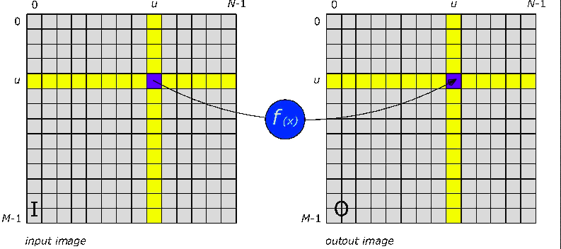
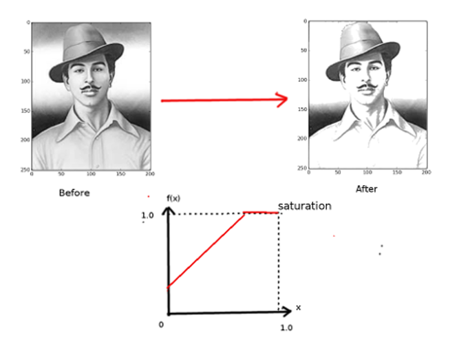
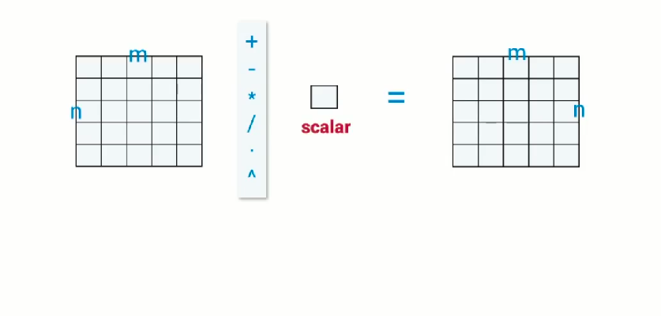
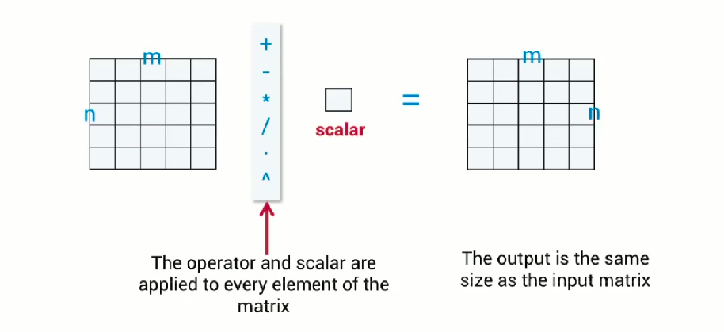
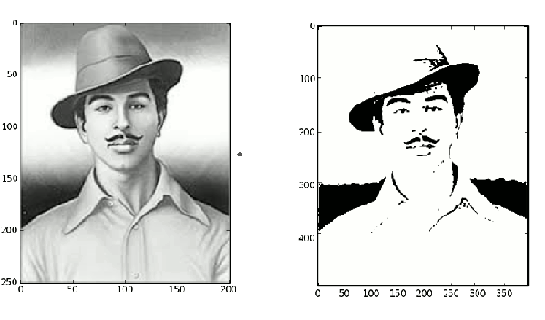
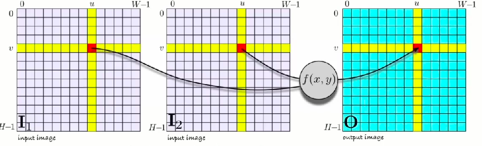

<link rel="stylesheet" href="css/theme/beige.css" id="theme">


---

#Histogram

---

<section data-background="screenshots/m3.png"></section>

---

<section data-background="screenshots/m4.png"></section>

---

<section data-background="screenshots/m5.png"></section>

---

<section data-background="screenshots/m5x.png"></section>

---

#some slides here

---

<section data-background="screenshots/m10.png"></section>
<span style="background-color:rgb(1,1,1);display:block;opacity:0.6;color:white">Its a grey color image.</span>

---


#Monadic Operations

---

<h2 style="text-align:left;"><span style="color:rgb(220,54,54);">Monadic</span> processing </h2>

<ul>
<li> Each output pixel is a function of corresponding input pixel.</li>
<li> The function is <span style="color:rgb(220,54,54)">the same</span> for all pixels.</li>
</ul>

---

<h2 style="text-align:left;"><span style="color:rgb(220,54,54);">Monadic</span> image processing </h2>
<section></section>

---

<h2 style="text-align:left;"><span style="color:rgb(220,54,54);">Monadic</span> image processing </h2>
<section></section>

<section></section>

---

<h2><span style="color:rgb(220,54,54)">Monodic image</span> processing</h2>
<ul><li><span style="color:rgb(220,54,54)">what is f(x)?</span>
<ul>
<li class="fragment">changing the datatype</li>
<li class="fragment">changing the brightness and contrast</li>
<li class="fragment">histogran normalization</li>
<li  class="fragment">threshloding</li>
<li class="fragment">posterization</li>
</ul></li></ul>

---

<section data-background="screenshots/o9.png"></section>

---

<h3><span style="color:rgb(220,54,54)">Changing</span> brightness</h3>

<span style="background-color:rgb(1,1,1);display:block;opacity:0.6;color:white">

---

<h3><span style="color:rgb(220,54,54)">Code </span>to change brightness</h3>

```
import cv2
#bright image
def bright(img,n):
	cc,rr,dd =img.shape
	n=input(" enter no. in range 0-255 ")
	imgB=img+n
	for a in range(cc):
		for b in range(rr):
				if (imgB[a][b][0]<n or imgB[a][b][1]<n or
                                   imgB[a][b][2]<n ):
					imgB[a][b]=255
	return imgB

```
</span>

---

<h3><span style="color:rgb(220,54,54)">Changing</span> contrast</h3>

---

<h3><span style="color:rgb(220,54,54)">negative</span> image</h3>

---

<h3><span style="color:rgb(220,54,54)">Posterization</span></h3>

---

#Histogram Normalization

---

<section data-background="screenshots/p6.png"></section>

---

<section data-background="screenshots/p7.png"></section>

---

<section data-background="screenshots/p8.png"></section>

---

<section data-background="screenshots/p9.png"></section>

---

<section data-background="screenshots/q1.png"></section>

---

#Gamma Correction

---

<section data-background="screenshots/q5.png"></section>

---

<section data-background="screenshots/q6.png"></section>

---

<section data-background="screenshots/q7.png"></section>

---

<section data-background="screenshots/q8.png"></section>

---

<section data-background="screenshots/q9.png"></section>

---

<section data-background="screenshots/r1.png"></section>

---

<h3><span style="color:rgb(220,54,54)">monadic</span> function</h3>

---


#Vectorization

---

<h3><span style="color:rgb(220,54,54)">Matrix</span> Operation</h3>
<section></section>

---

<h3><span style="color:rgb(220,54,54)">Matrix</span> Operation</h3>
<section></section>

---

#Thresholding

---

<h3><span style="color:rgb(220,54,54)">Thresholding</span> </h3>
<ul>
<li><span style="color:rgb(220,54,54)">The resulting image has only two values:</span>
<ul>
<li class="fragment">false (black) if x<T</li>
<li class="fragment">true (white) if x>=T </li>
</ul></li></ul>



---

#Diadic Operations

---

<h3><span style="color:rgb(220,54,54)">diadic</span> operation</h3>

<ul>
<li> Each output pixel is a function of corresponding input pixel.</li>
<li> The function is <span style="color:rgb(220,54,54)">the same</span> for all pixels.</li>
</ul>

---

<section data-background="screenshots/t2.png"></section>


